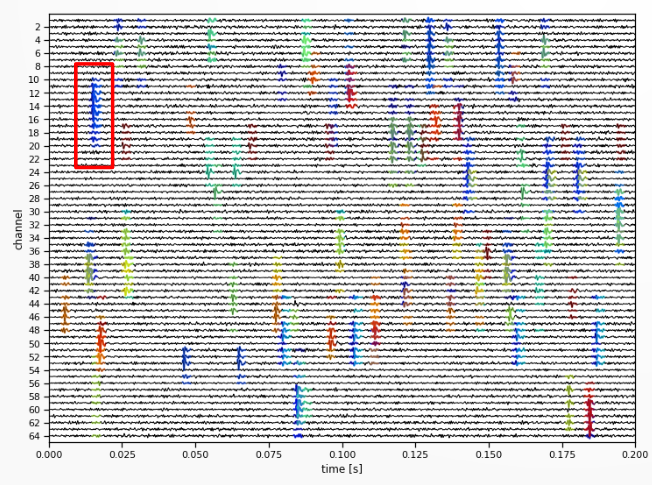

# Pipeline walkthrough with SpikeInterface {.unnumbered}
\
In this chapter, we will implement a spike sorting pipeline from start to finish, using SpikeInterface.
We will go through the key steps at a high level here, and develop the theory and add more complex methods and
use cases in the following chapters.

In this walkthrough, we will use a short example dataset available for download [here]().
This dataset contains 2.5 seconds of data recorded on 384 channels, with channels
located on the middle two shanks of a 4-shank Neuropixels probe, acquired in SpikeGLX.

We will load and preprocess the data, run spike sorting and compute quality metrics
for assessing the sorting output.

Let's get started!
 
## Data Loading and Exploration

### Data Loading

First, we will load the data, currently saved on our hard drive, into Python.

SpikeInterface can load data from many different types of acquisition systems, using functions within its [extractors module](https://spikeinterface.readthedocs.io/en/stable/modules/extractors.html). As our data is from SpikeGLX, we will use the `read_spikeglx` method.

We need to tell SpikeInterface where the data is, and what [data stream](concept-notes.qmd#spikeglx-streams)💡 we want to load. A stream refers to a continuous recording of voltage signals from a specific set of channels, sampled at a fixed rate. SpikeGLX saves different streams to separate files depending on the frequency band and channel type. Streams written by SpikeGLX can include the action potential (AP) band, local field potential (LF) band and a sync stream (depending on the version).

Because we want to load the AP data stream for spike sorting, we pass `"imec0.ap"`.

```{python}
import spikeinterface.extractors as si_extractors

# This should be the path to the folder containing
# the data. On Windows, you may need to prepend
# r to the string e.g. r"C:\my\path"
path_to_data_folder = "data/pipeline-walkthrough"

recording = si_extractors.read_spikeglx(
    path_to_data_folder,
    stream_id="imec0.ap"
)

print(recording)
```

SpikeInterface uses 'lazy loading', which means at this stage no data is actually loaded into memory. Data is only loaded when we request it (e.g. for visualisation, or spike sorting)
and only the requested chunk is loaded. This makes operations very fast as we do not need to load
large recordings up-front.

### The Recording object

SpikeInterface extractor functions return the recording as a [Python object](https://www.geeksforgeeks.org/python/python-classes-and-objects/), which contains many useful methods for exploring the recording metadata as well as accessing the underlying data. In our case, recording is a `SpikeGLXRecordingExtractor` recording object.

The [SpikeInterface API Documentation](https://spikeinterface.readthedocs.io/en/latest/api.html) is a useful resource for looking up methods associated with an object and their arguments.  In Spikeinterface, all recordings [inherit](concept-notes.qmd#inheritence)💡 from the `BaseRecording`, so checking out the [API docs for BaseRecording](https://spikeinterface.readthedocs.io/en/latest/api.html#spikeinterface.core.BaseRecording) gives us iformation about all recording objects. 

You can also use Python's `dir()` functoin to see all attributes and methods associated with any Python object.

```{python}

print(
    [method for method in dir(recording) if method.startswith("get")]
)
```


:::{.callout-tip}
### Things to try 

This is a good time to explore the recording object using the API docs. Have a go at the following:

- Print the locations of all channels on the probe.
- Print the time vector associated with the recording.
- Use `get_traces()` to retrieve a segment of raw data as a NumPy array. What are its dimensions?
:::

### Visualising the probe

There are many brands of recording probes used in extracellular electrophysiology (e.g. 
[Neuropixels](https://www.neuropixels.org/), 
[Cambridge Neurotech](https://www.cambridgeneurotech.com/neural-probes) or
[NeuroNexus](https://www.neuronexus.com/products/electrode-arrays/)
). There are many models, which come in complex and varied geometries and channel arangements

Under the hood, SpikeInterface uses the ProbeInterface package to load many different types of probe. In our case, it automatically identifie and loaded a Neuropixels 2 (NP2) probe.

It is important to check that the probe has loaded as expected, and that the geometry matches how it was set up in your acquisition software. We can plot the probe to confirm it loaded correctly:

```{python}
from probeinterface.plotting import plot_probe
import matplotlib.pyplot as plt

probe = recording.get_probe()

plot_probe(probe)
plt.show()

```

As expected, we have a 4-shank Neurpixels probe in which all the recording channels are located in the middle two shanks. The argument [`show_contact_ids`](https://probeinterface.readthedocs.io/en/main/api.html#probeinterface.plotting.plot_probe) can also be used to display the contact IDs, to double check the exact location of each contact.

### Visualising the data

Electrophysiological recordings are susceptible to contamination from multiple noise sources: electrical interference, mechanical noise caused by probe movement, and artefacts arising from hardware defects or poor contact.

As such, it is important to visualise the data, especially after preprocessing, to check the data quality. First, lets's plot one second of data from our raw recording:

```{python}
import spikeinterface.widgets as si_widgets

start_time = recording.get_times()[0]

si_widgets.plot_traces(
    recording,
    time_range=(start_time, start_time + 0.1),
    return_in_uV=True,
    order_channel_by_depth=True
)
plt.show()
```


`return_in_uV` to ensure the data is returned in interpretable units (microvolts), as by default 
most electrophysiological recordings are [stored as unitless `int16` values](concept-notes.qmd#data-storage-in-int16-and-scaling-to-uv)💡.

`order_channel_by_depth` is used as the default ordering of channels on the probe is not always by depth, meaning the order is scrambled on the plot.

:::{.callout-tip}
### Tip
In general when working with raw data, you can use [`recording.get_channel_locations()`](https://spikeinterface.readthedocs.io/en/latest/api.html#spikeinterface.core.BaseRecording.get_channel_locations) to inspect the default channel ordering of the 
channels, and [`order_channels_by_depth()`](https://spikeinterface.readthedocs.io/en/stable/api.html#spikeinterface.core.order_channels_by_depth) function can be used to get the indicies for reordering.

:::

As we can see - the raw data looks terrible! It is severely contaminated, mostly by electrical noise. We will need to preprocess it to tidy it up.

## Preprocessing

Below, we will apply three key preprocessing steps: 

**phase_shift** : corrects a hardware artefact in the Neuropixels probe 
which causes small shifts between the recording time across nearby channels.

**bandpass_filter** : removes high and low frequency oscillations from the data. It is applied to each channel separately. 

**commmon_reference** : removes noise spikes that appear as verticle stripes across the data. It is applied across channels separately at each timepoint.

To preprocess the data, we will pass our recording object into functions that return a new, recording object. e.g. ```filtered_recording = bandpass_filter(recording)```. We can do this for every step in the preprocessing chain:

```{python}
import spikeinterface.preprocessing as si_prepro

phase_shift_recording = si_prepro.phase_shift(recording)
filtered_recording = si_prepro.bandpass_filter(
    phase_shift_recording, freq_min=300, freq_max=6000
)
cmr_recording = si_prepro.common_reference(
    filtered_recording, operator="median"
)
```

In SpikeInterface, the preprocessing is applied almost instantly due to the 'lazy' loading
mentioned earlier. When we apply the preprocessing function, we only really just change the metadata associated with the recording, the data is not actually changed at this stage.

Only when we get the data (e.g. in `plot_traces`, or with `get_traces()` or when saving the data) is the data preprocessed in the requested chunk. This makes operating very fast!

Now we are ready to plot the data:

```{python}

si_widgets.plot_traces(
    cmr_recording,
    time_range=(start_time, start_time + 0.1),
    return_in_uV=True,
    order_channel_by_depth=True
)
plt.show()

```

As you can see, it is much cleaner and we can see action potentials firing! However, there does seem to be an artefact, small gaps in the action potential waveform. We will investigate these in the next section.

### Splitting the data by shank

You might notice the data in the above image looks slightly strange. All spikes have predictable gaps between them, we can see this clearly if we zoom into a single action potential waveform:

```{python}
si_widgets.plot_traces(
    cmr_recording,
    time_range=(23.923, 23.928),
    return_in_uV=True,
    order_channel_by_depth=True,
)
ax = plt.gca()
ax.set_ylim(200, 300)
plt.show()
```

:::{.callout-note icon=false}
### Discuss
Look carefully at the plot above. Why do you think there are predictable gaps in the signal every two channels?
:::

::: {.callout-note collapse="true"}
### Click to reveal the answer

Our recording channels are located on two shanks, however we have plot all recording channels
together. The channels on different shanks have the same y-position, so they are plot
next to eachother, but different x-positions. 

This means that the AP recorded on one shanks channels is interleaved with blank channels from the other shank. 

:::

We can solve this by spliting the recording by shank with the `groups` property. When SpikeInterface loads the data, it will automatically assign different shanks to different groups:

```{python}

split_recording = cmr_recording.split_by("group")
print(
    split_recording
)
```

We can plot both shanks separately:

```{python}

fig, ax = plt.subplots(1, 2)

for shank_idx, shank_recording in split_recording.items():

    si_widgets.plot_traces(
        shank_recording,
        time_range=(start_time, start_time + 0.1),
        return_in_uV=True,
        order_channel_by_depth=True,
        ax=ax[shank_idx]
    )
    ax[shank_idx].set_title(f"Shank: {shank_idx}")

plt.show()
```

```{python}

si_widgets.plot_traces(
    split_recording[0],
    time_range=(23.923, 23.926),
    return_in_uV=True,
    order_channel_by_depth=True,
    mode="map"
)
ax = plt.gca()
ax.set_ylim(200, 300)
plt.show()
```

Much better!

Now we have our preprocessed data, and have visually confirmed the data quality is good, we are ready to perform spike sorting! 

:::{.callout-tip}
### Things to try
- How does the data look using `median` vs. `mean` for `common_average`?
- What happens if you set the bandpass filter minimum cutoff to zero? What frequencies are including now? Or set the maximum cutoff to 15000?
- Set `return_in_uV=False`. Does the data look much different?
- Save the data to disk with the Recording objects `.save` attribute
- Use `get_traces()` with and without `return_in_uV` as `True` and `False` to inspect the data type.
- Perform spike detection (e.g. absolute threshold method) on the preprocessed data obtained with `get_traces()`

:::


## Sorting

Now we are ready to move onto spike sorting. There are many possible spike sorters
to choose from, today we will use Kilosort 4.

All we need to do is pass our preprocessed recording to the sorter of choice, 
along with any parameters. In our case, we will skip the filtering and common average
referencing that Kilosort 4 can perform, as we have already run these steps in SpikeInterface (we cannot turn filtering off, so just set it to a very low cutoff).

Kilosort will then detect spikes and assign each spike to a unit (i.e. a putative neuron). It will output the time of each spike, what unit it belongs to.

It is often easiest to sort each shank separately. From now on, we will only sort the first shank of the recording.

In SpikeInterface, running a sorter is quite simple:

```{python}
from pathlib import Path
import spikeinterface.sorters as si_sorters

sorter_folder = Path("kilosort4_output")
sorter_output_folder = sorter_folder / "sorter_output"

first_shank_recording = split_recording[0]

sorting = si_sorters.run_sorter(
    "kilosort4",
    first_shank_recording,
    folder=sorter_folder,
    remove_existing_folder=True,
    do_CAR=False,
    highpass_cutoff=0.1,
)

print(sorting)
```

The sorting output is written to disk. The output contains all of the output files of the sorter, and its organisation is sorter-dependent. As we as spike times and unit assignments, it contains other outputs from the sorter e.g. representative waveforms for each units ('templates').

In SpikeInterface, we can access the spike times and unit assignments in a
sorter-independent manner, using the [`sorting`](https://spikeinterface.readthedocs.io/en/latest/api.html#spikeinterface.core.BaseSorting) object. For example, to
get the spike times and unit assignments:

```{python}

spikes = sorting.to_spike_vector()

spike_times = spikes["sample_index"] / sorting.get_sampling_frequency()

# show the first 5 spikes
print(
    f"`spikes` is a structured number array with fields`: {spikes.dtype.names}\n"
)
print(
    f"First 5 spike times (s): {spike_times[:5]}\n"
)
print(
    f"First 5 unit assignments: {spikes['unit_index'][:5]}"
)

```


:::{.callout-tip}
### Things to try
 - Get a list of all non-empty unit ids
 - Remove a unit - what happens to the spikes assigned to this unit?
 - Get the spike times for a specific unit
:::

## Postprocessing

TODO! Depending on timing and content of the other sections, we 
may want to reduce this down to a single command where
we compute all of the extensions, and then
go through them in more detail in the SpikeInterface GUI

Spike sorting is a complex task undertaken in the precense of significant noise. Therefore, many units will not cleanly represent a single neuron. As well as **good** units (i.. where each spike is from the same putative neuron) units may be **noise** (XXX) or **multi-unit activity (MUA)**. 

To determine whether units are good or not, we must look at the individual spikes that belong to a unit, and compute metrics. Cut then out, waveforms. In this section we will go over some key concepts at a very high level - we will develop this much further in the Postprocessing chapter.


### Creating a `SortingAnalzyer`

The `SortingAnalzyer` is the key object for postprocessing in SpikeInterface. We can create the `SortingAnalzyer` by passing the sorting output and preprocessed recording:

```{python}
from spikeinterface import create_sorting_analyzer

analyzer = create_sorting_analyzer(
    sorting=sorting,
    recording=first_shank_recording
)
```

Using this sorting analyzer interface, we will compute all of the
postprocessing results needed to assess the quality of our sorting.

:::{warning}

Some sorters will output their own waveforms, templates, amplitudes ETC (for example, Kilosort has a `templates.npy` file containnig the templates it generated during sorting).

These are not loaded by SpikeInterface. Instead, the sorting analzyer will always recompute these features directly from the passed `recording`.

:::

### Selecting spikes

In our sorting, we can have many many detected spikes. This may be in the order of millios of spikes for an hour long recording.

In general, we will compute summary statistics over metrics computed from individual spikes. Therefore, including millions of spikes is computationally intensive while providing marginal gains. Instead, we can subselect spikes to include in postprocessing computations (typically, 3-500 spikes per unit is used a default).

```{python}
analyzer.compute(
    "random_spikes",
    method="uniform",
    max_spikes_per_unit=500,
)
```

To access the data assicated with a computed extension, we can use the `get_extension` function as below. We can see the indices (and compute the 
spike times) for the selected spikes:

```{python}
spike_indices = analyzer.get_extension("random_spikes").data["random_spikes_indices"]
spike_times = spike_indices / recording.get_sampling_frequency()

print(spike_times)
```

### Waveforms

The action potential waveforms are important for assessing unit quality. For example, we expect that the waveforms of spikes which belong to a single unit are all similar.

To compute waveforms in SpikeInterface, we can use the `waveforms` extension. This will 'chop out' the spike waveform from the data, with a time window specified by the `ms_before` and `ms_after` (the spike peak) arguments. For example in the schematic below, we could cut out the blue spike in a window defined by the red blox:



```{python}
analyzer.compute("waveforms", ms_before=1.0, ms_after=2.0)
```

The waveforms array is three dimensional `(num waveforms, num samples, num channels)

```{python}
waveforms = analyzer.get_extension("waveforms").data["waveforms"]

print(waveforms.shape)

# This is the waveform of the 19th spike (chosen as it looks nice)
plt.imshow(waveforms[18, :, :].T, aspect="auto")
plt.show()
```

### Templates

The template is a representative wavecform from a putative neuron. Often, it is computed as the average waveform from all of the spikes that were assigned to a unit.

We can compute the extension and access the templates with:

```{python}
analyzer.compute("templates")

templates = analyzer.get_extension("templates").data["average"]

print(
    templates.shape
)
```

SpikeInterface also includes many useful post-processing plots in the widget smodule. For example  we can plot a unit template as below:

```{python}

# Plot the template waveform of the first unit 
si_widgets.plot_unit_templates(analyzer, unit_ids=[0])
plt.show()

```

### Amplitudes

Finally, spike amplitudes are a useful measure for assessing unit quality. We expect that the amplitude of a spike is relatively stable througghout a recording. Changes in spike amplitudes may indicate problems with hte neuron health, drift, or other issues. 

To compute the spike amplitudes, we can run:

```{python}

analyzer.compute("spike_amplitudes")

amplitudes = analyzer.get_extension("spike_amplitudes").data["amplitudes"]

print(amplitudes)
```

This gives a list of amplitudes, one for every spike. We will explore how visualisng spike amplitude across time is a useful measure for quality asessment later.

## Manual Curation in spikeinterface-gui

From this, we can compute quality metrics used to filter the units e.g. bombcell. We cover this more in the postprocessing chapter.

For now, see SpikeInterface GUI video?

https://www.youtube.com/watch?v=OGlQtxzip-Q


