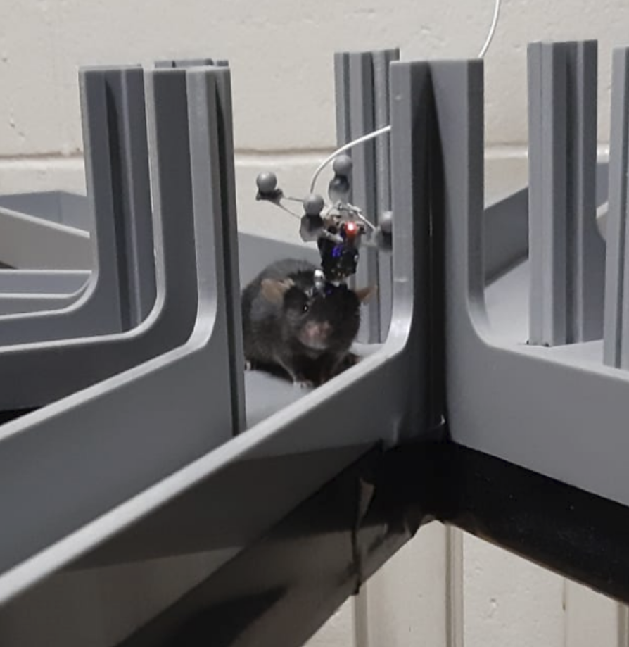

# Neural analysis with Pynapple {.unnumbered}

This chapter is an introduction to [Pynapple](pynapple.org).  
Pynapple is a python package for analysing neural data.  
The package is actively maintained by the Flatiron Institute's [neuroRSE team](https://neurorse.flatironinstitute.org/). 

The only thing you'll need to follow along is a working Python environment with `pynapple` installed:

```python
pip install pynapple
```

Now just open your favourite way of running Python, and follow along!

## Origins

- __2000:  TSToolbox, MATLAB__  
McNaughton lab: David Redish & Francesco Battaglia  

- __2016:  TSToolbox2, MATLAB__  
Adrien Peyrache & Luke Sjulson  

- __2018:  neuroseries,  Python__  
Francesco Battaglia  

- __2021:  pynapple, Python__  
Guillaume Viejo  

presently with the Flatiron Institute's neuroRSE team:

- __Guillaume Viejo__
- __Sarah Jo Venditto__
- Edoardo Balzani
- William Broderick

\+ __Wolf De Wulf__, a 2025 neuroRSE intern


## Goal
Pynapple was designed to lie in between pre- and postprocessing.  
It contains functions facilitating alignment, wrangling, and performing basic neuroscientific analysis.

<div class="timeline-horizontal">
<div class="timeline-entries-horizontal">
<div class="timeline-entry">
  <b>Recording</b><br>
  
</div>

<div class="timeline-entry">
  <b>Preprocessing</b><br>
  segmenting (`calman`)<br>
  spike-sorting (`spikeinterface`)
</div>
<div class="timeline-entry logo">
  
</div>
<div class="timeline-entry">
  <b>Postprocessing</b><br>
  model fitting (`nemos`)<br>
  interpretation (`you`)
</div>
</div>
<div class="timeline-arrow"></div>
</div>
<style>
.timeline-horizontal {
  height: 20vh;
  display: flex;
  flex-direction: column;
  justify-content: center;
}
.timeline-arrow {
  position: relative;
  width: 90%;
  height: 6px;
  background: currentColor;
  margin: 1em auto 0;
}
.timeline-arrow::after {
  content: "";
  position: absolute;
  right: -6px;
  top: -9px;
  border-top: 12px solid transparent;
  border-bottom: 12px solid transparent;
  border-left: 18px solid currentColor;
}
.timeline-entries-horizontal {
  display: grid;
  grid-template-columns: 1fr 1fr 0.5fr 1fr;
  align-items: center;
  width: 90%;
  margin: 0 auto 1em;
}
.timeline-entry {
  text-align: center;
  font-size: 1.1em;
}
.logo {
  margin: 0 1em;
}
</style>

## 1. Pynapple fundamentals

### Time series (`Ts`)
```{python}

import pynapple as nap
ts = nap.Ts(t=[1,2,3,4,5])
ts
```
```{python}
#| echo: false

import matplotlib.pyplot as plt
fig, ax = plt.subplots(constrained_layout=True, figsize=(5,3))
for timepoint in ts.times():
    ax.axvline(timepoint)
ax.yaxis.set_visible(False)
ax.spines['left'].set_visible(False)
ax.spines['right'].set_visible(False)
ax.spines['top'].set_visible(False)
ax.set_xlabel("time (s)")
plt.show()
```

### Time series with data (`Tsd`)

```{python}
import pynapple as nap
import numpy as np
tsd = nap.Tsd(t=[1,2,3,4,5], d=[1,1,1,2,1])
tsd
```
```{python}
#| echo: false

import matplotlib.pyplot as plt
fig, ax = plt.subplots(constrained_layout=True, figsize=(5,3))
ax.plot(tsd)
ax.spines['top'].set_visible(False)
ax.spines['right'].set_visible(False)
ax.set_xlabel("time (s)")
ax.set_ylabel("data (a.u.)")
plt.show()
```

### Multiple time series
```{python}
import pynapple as nap
tsgroup = nap.TsGroup({
    1: nap.Ts([1,2,3,4,5]), 
    2: nap.Ts([1.5, 2.2, 2.9, 4.2])
})
tsgroup
```
```{python}
#| echo: false

import matplotlib.pyplot as plt
import numpy as np
cmap = plt.get_cmap("tab10")
fig, ax = plt.subplots(constrained_layout=True, figsize=(5,3))
for i in tsgroup:
    ax.vlines(tsgroup[i].times(), i, i+1, label=i, color=cmap(i-1))
ax.yaxis.set_visible(False)
ax.spines['left'].set_visible(False)
ax.spines['right'].set_visible(False)
ax.spines['top'].set_visible(False)
ax.set_xlabel("time (s)")
plt.ylim(1,3)
plt.legend(frameon=False)
plt.show()
```

### Time series with multiple data columns (`TsdFrame`)
```{python}
import pynapple as nap
tsdframe = nap.TsdFrame(
    t=[1,2,3,4,5], 
    d=[[1,2],
       [1,2],
       [1,3],
       [2,1],
       [1,2]],
    columns=["A", "B"]
)
tsdframe
```
```{python}
#| echo: false
import matplotlib.pyplot as plt
import numpy as np
fig, ax = plt.subplots(constrained_layout=True, figsize=(5,3))
for i, col in enumerate(tsdframe.columns):
    ax.plot(tsdframe[:, i], label=col)
ax.set_ylabel("data (a.u.)")
ax.set_xlabel("time (s)")
ax.spines['top'].set_visible(False)
ax.spines['right'].set_visible(False)
plt.legend(frameon=False)
plt.show()
```

### Intervals (`IntervalSet`)
```{python}
import pynapple as nap
epochs = nap.IntervalSet(
    start=[1, 3, 7],
    end=[2, 5, 9]
)
epochs
```
```{python}
#| echo: false

import matplotlib.pyplot as plt
fig, ax = plt.subplots(constrained_layout=True, figsize=(5,3))
for start, stop in epochs.values:
    ax.axvspan(start, stop)
ax.set_xlabel("time (s)")
ax.spines['left'].set_visible(False)
ax.spines['right'].set_visible(False)
ax.spines['top'].set_visible(False)
plt.show()
```

## 2. Interactions

### Time supports (`time_support`)
```{python}
import pynapple as nap
ts = nap.Ts(t=[1,2,3,4,5])
ts.time_support
```
```{python}
#| echo: false
import matplotlib.pyplot as plt
fig, ax = plt.subplots(constrained_layout=True, figsize=(5,3))
for timepoint in ts.times():
    ax.axvline(timepoint)
for start, stop in ts.time_support.values:
    ax.axvspan(start, stop, alpha=0.2)
ax.yaxis.set_visible(False)
ax.spines['left'].set_visible(False)
ax.spines['right'].set_visible(False)
ax.spines['top'].set_visible(False)
ax.set_xlabel("time (s)")
plt.show()
```

### Restricting (`restrict`)
```{python}
import pynapple as nap
ts = nap.Ts(t=[1,2,3,4,5])
restriction = nap.IntervalSet(start=[1.3, 3.9], end=[3.5, 4.2])
restricted = ts.restrict(restriction)
restricted
```
```{python}
#| echo: false
import matplotlib.pyplot as plt
fig, ax = plt.subplots(constrained_layout=True, figsize=(5,3))
for timepoint in restricted.times():
    ax.axvline(timepoint)
for start, stop in restricted.time_support.values:
    ax.axvspan(start, stop, alpha=0.2)
ax.yaxis.set_visible(False)
ax.spines['left'].set_visible(False)
ax.spines['right'].set_visible(False)
ax.spines['top'].set_visible(False)
ax.set_xlabel("time (s)")
plt.show()
```

### Taking values (`value_from`)
```{python}
import pynapple as nap
import numpy as np
ts = nap.Ts(t=[1,2,3,4,5])
tsd = nap.Tsd(t=np.arange(0, 10, 0.1), d=np.random.randn(100))
values = ts.value_from(tsd)
values
```
```{python}
#| echo: false
import matplotlib.pyplot as plt
fig, ax = plt.subplots(constrained_layout=True, figsize=(5,3))
ax.plot(tsd, label="tsd")
ax.plot(values, label="values", linestyle="none", marker=".")
minimum = tsd.values.min()
cmap = plt.get_cmap("tab10")
for timepoint, value in zip(values.times(), values.values, strict=True):
    ax.vlines(timepoint, ymin=minimum, ymax=value, color=cmap(1))
ax.set_ylabel("data (a.u.)")
ax.set_xlabel("time (s)")
ax.spines['right'].set_visible(False)
ax.spines['top'].set_visible(False)
plt.legend(frameon=False)
plt.show()
```

## 3. Wrangling

### Numpy
```{python}
import pynapple as nap
import numpy as np
tsdframe = nap.TsdFrame(
    t=[1,2,3,4,5], 
    d=[[1,2],
       [1,2],
       [1,3],
       [2,1],
       [1,2]],
    columns=["A", "B"]
)
np.mean(tsdframe, axis=1)
```
```{python}

import pynapple as nap
import numpy as np
tsdframe = nap.TsdFrame(
    t=[1,2,3,4,5], 
    d=[[1,2],
       [1,2],
       [1,3],
       [2,1],
       [1,2]],
    columns=["A", "B"]
)
np.diff(tsdframe, axis=1)
```

### Slicing
```{python}
import pynapple as nap
import numpy as np
tsdframe = nap.TsdFrame(
    t=[1,2,3,4,5], 
    d=[[1,2],
       [1,2],
       [1,3],
       [2,1],
       [1,2]],
    columns=["A", "B"]
)
tsdframe[:, 1]
```
```{python}

import pynapple as nap
import numpy as np
tsdframe = nap.TsdFrame(
    t=[1,2,3,4,5], 
    d=[[1,2],
       [1,2],
       [1,3],
       [2,1],
       [1,2]],
    columns=["A", "B"]
)
tsdframe[2:4]
```

## 4. Core functions

### Binning
```{python}
import pynapple as nap
import numpy as np
dt = 0.001
times = np.arange(0, 4, dt)
rate = 40 * (1 + np.sin(2*np.pi*times)) / 2
spikes = nap.Ts(times[np.random.rand(len(times)) < rate * dt])
counts = spikes.count(0.1)
counts
```
```{python}
#| echo: false

import matplotlib.pyplot as plt
fig, (ax_spikes, ax_count) = plt.subplots(2, 1, constrained_layout=True, figsize=(5,3), sharex=True)
ax_spikes.vlines(spikes.times(), 0, 1)
ax_spikes.set_ylabel("spikes")
ax_spikes.set_yticks([])
ax_spikes.spines['left'].set_visible(False)
ax_spikes.spines['right'].set_visible(False)
ax_spikes.spines['top'].set_visible(False)
ax_count.plot(counts)
ax_count.set_ylabel("count")
ax_count.set_xlabel("time (s)")
ax_count.spines['right'].set_visible(False)
ax_count.spines['top'].set_visible(False)
plt.show()
```

### Averaging
```{python}
import pynapple as nap
import numpy as np
times = np.arange(0, 10, 0.01)
signal = np.sin(2 * np.pi * times) 
signal += 0.2 * np.random.randn(len(times))
tsd = nap.Tsd(t=times, d=signal)
averaged = tsd.bin_average(0.2)
averaged
```
```{python}
#| echo: false

import matplotlib.pyplot as plt
fig, ax = plt.subplots(constrained_layout=True, figsize=(5,3))
plt.plot(tsd, label="original")
plt.plot(averaged, label="averaged")
ax.set_ylabel("data (a.u.)")
ax.set_xlabel("time (s)")
ax.spines['right'].set_visible(False)
ax.spines['top'].set_visible(False)
fig.legend(frameon=False, bbox_to_anchor=(1.0, 1.1))
plt.show()
```

### Thresholding
```{python}
import pynapple as nap
import numpy as np
times = np.arange(0, 10, 0.01)
signal = np.sin(2 * np.pi * times) 
signal += 0.2 * np.random.randn(len(times))
tsd = nap.Tsd(t=times, d=signal)
above = tsd.threshold(0.5, method="above")
below = tsd.threshold(-.5, method="below")
above.time_support
```
```{python}
#| echo: false

import matplotlib.pyplot as plt
fig, ax = plt.subplots(constrained_layout=True, figsize=(5,3))
ax.plot(tsd, label="original")
ax.plot(above, label="above", marker=".", linestyle="none")
ax.plot(below, label="below", marker=".", linestyle="none")
ax.spines['right'].set_visible(False)
ax.spines['top'].set_visible(False)
fig.legend(frameon=False, bbox_to_anchor=(1.0, 1.2))
plt.show()
```

### Smoothing
```{python}
import pynapple as nap
import numpy as np
times = np.arange(0, 10, 0.01)
signal = np.sin(2 * np.pi * times) 
signal += 0.2 * np.random.randn(len(times))
tsd = nap.Tsd(t=times, d=signal)
smoothed = tsd.smooth(std=0.1)
smoothed
```
```{python}
#| echo: false

import matplotlib.pyplot as plt
fig, ax = plt.subplots(constrained_layout=True, figsize=(5,3))
ax.plot(tsd, label="original")
ax.plot(smoothed, label="smoothed")
ax.set_ylabel("data (a.u.)")
ax.set_xlabel("time (s)")
ax.spines['right'].set_visible(False)
ax.spines['top'].set_visible(False)
fig.legend(frameon=False, bbox_to_anchor=(1.0, 1.1))
plt.show()
```

## 5. Advanced Functions

### Autocorrelograms
```{python}
import pynapple as nap
import numpy as np
dt = 0.01
times = np.arange(0, 4, dt)
rate = 40 * (1 + np.sin(2*np.pi*times)) / 2
units = nap.TsGroup({
    1: nap.Ts(times[np.random.rand(len(times)) < rate * dt]),
    2: nap.Ts(times[np.random.rand(len(times)) < rate*2 * dt]),
})
autocorrelogram = nap.compute_autocorrelogram(
    units, binsize=0.1, windowsize=1.0, norm=False
)
autocorrelogram
```
```{python}
#| echo: false

import matplotlib.pyplot as plt
ax=autocorrelogram.plot()
plt.ylabel("rate (Hz)")
plt.xlabel("time (s)")
ax.spines['right'].set_visible(False)
ax.spines['top'].set_visible(False)
plt.legend(frameon=False)
plt.show()
```
### Crosscorrelograms
```{python}
crosscorrelogram = nap.compute_crosscorrelogram(
    units, binsize=0.1, windowsize=1.0, norm=False
)
crosscorrelogram
```
```{python}
#| echo: false
import matplotlib.pyplot as plt
ax=crosscorrelogram.plot()
plt.ylabel("rate (Hz)")
plt.xlabel("time (s)")
ax.spines['right'].set_visible(False)
ax.spines['top'].set_visible(False)
plt.legend(frameon=False)
plt.show()
```

### Signal processing

We'll start by simulating a noisy multi-frequency signal:
```{python}
import pynapple as nap
import numpy as np
fs = 1000
t = np.linspace(0, 2, fs * 2)
f2 = np.cos(t*2*np.pi*2)
f10 = np.cos(t*2*np.pi*10)
f50 = np.cos(t*2*np.pi*50)
tsd = nap.Tsd(t=t,d=f2+f10+f50 + np.random.normal(0, 0.5, len(t)))
tsd
```
```{python}
#| echo: false
import matplotlib.pyplot as plt
fig, ax = plt.subplots(constrained_layout=True, figsize=(5,3))
ax.plot(tsd)
ax.set_ylabel("data (a.u.)")
ax.set_xlabel("time (s)")
ax.spines['right'].set_visible(False)
ax.spines['top'].set_visible(False)
plt.show()
```

#### Bandpass filter
```{python}
filtered = nap.apply_bandpass_filter(
    data=tsd, 
    cutoff=(8, 12), 
    fs=fs, 
    mode='butter'
)
filtered
```
```{python}
#| echo: false

import matplotlib.pyplot as plt
fig, ax = plt.subplots(constrained_layout=True, figsize=(5,3))
ax.plot(filtered)
ax.set_ylabel("data (a.u.)")
ax.set_xlabel("time (s)")
ax.spines['right'].set_visible(False)
ax.spines['top'].set_visible(False)
plt.show()
```

#### Power-spectral density
```{python}
psd = nap.compute_power_spectral_density(
    tsd, 
    fs=fs
)
psd
```
```{python}
#| echo: false
import matplotlib.pyplot as plt
fig, ax = plt.subplots(constrained_layout=True, figsize=(5,3))
ax.plot(psd)
ax.set_ylabel("power")
ax.set_xlabel("frequency (Hz)")
ax.spines['right'].set_visible(False)
ax.spines['top'].set_visible(False)
plt.show()
```

### Perievent

Let's start by simulating a spiking unit that has clear stimulus-locked activity:
```{python}
import pynapple as nap
import numpy as np
stimuli = nap.Ts(t=np.arange(0, 1000, 1), time_units="s")
baseline = np.random.uniform(0, 1000, 500)
burst = np.concatenate([
        np.random.normal(
            st + 0.1, 0.05, 3
        ) 
        for st in stimuli.times()
    ])
ts = nap.Ts(t=np.sort(np.concatenate([baseline, burst])))
ts
```
```{python}
#| echo: false
import matplotlib.pyplot as plt
segment = nap.IntervalSet(100, 103.9)
fig, ax = plt.subplots(1, 1, constrained_layout=True)
ax.vlines(ts.restrict(segment).times(), 0.04, 0.10, label="spikes")
ax.vlines(
    stimuli.restrict(segment).times(),
    0.0,
    0.14,
    color="gray",
    linestyle="--",
    label="stimulus",
)
ax.yaxis.set_visible(False)
ax.spines["left"].set_visible(False)
ax.spines['right'].set_visible(False)
ax.spines['top'].set_visible(False)
ax.set_xlabel("time (s)")
plt.show()
```

Now, we can easily compute a peri-event time histogram (PETH) as follows:
```{python}
peth = nap.compute_perievent(
    data=ts, 
    events=stimuli, 
    window=(-0.1, 0.4))
peth
```

We can also bin the spikes:
```{python}
bin_size = 0.01
peth_counts = peth.count(bin_size)
peth_counts
```

Visualising everything together:
```{python}
#| echo: false
import matplotlib.pyplot as plt
fig, (ax_spikes, ax_mean) = plt.subplots(
    2, 1, sharex=True, height_ratios=[1, 0.3], figsize=(6, 6), gridspec_kw={"hspace": 0.3}
)
mean = np.mean(peth_counts / bin_size, axis=1)
ax_mean.plot(mean)
ax_mean.set_ylabel("spikes/s")
ax_mean.axvline(0.0, color="gray", linestyle="--")
ax_mean.spines['right'].set_visible(False)
ax_mean.spines['top'].set_visible(False)
ax_spikes.plot(peth.to_tsd(), "|", markersize=5)
ax_mean.set_xlabel("time from event (s)")
ax_spikes.set_ylabel("event")
ax_spikes.axvline(0.0, color="gray", linestyle="--")
ax_spikes.spines['right'].set_visible(False)
ax_spikes.spines['top'].set_visible(False)
plt.show()
```

### Tuning curves

Let's start by simulating some spiking units that are clearly modulated by a circular feature:
```{python}
import pandas as pd
import pynapple as nap
import numpy as np
from scipy.ndimage import gaussian_filter1d

N = 6 # Number of neurons
bins = np.linspace(0, 2*np.pi, 61)
x = np.linspace(-np.pi, np.pi, len(bins)-1)
tmp = np.roll(np.exp(-(1.5*x)**2), (len(bins)-1)//2)
tc = np.array([np.roll(tmp, i*(len(bins)-1)//N) for i in range(N)]).T

tc_1d = pd.DataFrame(index=bins[0:-1], data=tc)

# Feature
T = 10000
dt = 0.01
timestep = np.arange(0, T)*dt
feature = nap.Tsd(
    t=timestep,
    d=gaussian_filter1d(np.cumsum(np.random.randn(T)*0.5), 20)%(2*np.pi)
    )
index = np.digitize(feature, bins)-1

# Spiking activity
count = np.random.poisson(tc[index])>0
tsgroup = nap.TsGroup({i:nap.Ts(timestep[count[:,i]]) for i in range(N)})
epochs = nap.IntervalSet(0, 10)
tsgroup
```

We can use Pynapple to easily compute tuning curves with respect to the circular feature.  
The output is an [`xarray.DataArray`](https://docs.xarray.dev/en/stable/generated/xarray.DataArray.html):
```{python}
tuning_curves = nap.compute_tuning_curves(
    data=tsgroup,
    features=feature,
    bins=120, 
    range=(0, 2*np.pi),
    feature_names=["feature"]
    )
tuning_curves
```

These can be easily visualised:
```{python}
#| output: false
import matplotlib.pyplot as plt
tuning_curves.plot.line(x="feature", add_legend=False)
plt.ylabel("firing rate [Hz]")
```
```{python}
#| echo: false
tuning_curves.plot.line(x="feature", add_legend=False)
plt.ylabel("firing rate [Hz]")
plt.xticks([0, 2*np.pi], ["0", "2π"])
plt.show()
```

### Decoding
Given some tuning curves, Pynapple allows for easy [Bayesian decoding](https://journals.physiology.org/doi/full/10.1152/jn.1998.79.2.1017?rfr_dat=cr_pub++0pubmed&url_ver=Z39.88-2003&rfr_id=ori%3Arid%3Acrossref.org):
```{python}
decoded, proba_feature = nap.decode_bayes(
    tuning_curves=tuning_curves,
    data=tsgroup,
    epochs=epochs,
    sliding_window_size=4,
    bin_size=0.02,
)
decoded
```
```{python}
#| echo: false
import matplotlib.pyplot as plt
fig, (ax1, ax2) = plt.subplots(figsize=(6, 5), nrows=2, ncols=1, sharex=True)
ax1.plot(
    feature.times(),
    feature.values,
    label="true",
)
ax1.scatter(
    decoded.times(),
    decoded.values,
    label="decoded",
    c="orange",
)
ax1.spines['right'].set_visible(False)
ax1.spines['top'].set_visible(False)
fig.legend(frameon=False, bbox_to_anchor=(0.9, 1.0))
ax1.set_ylabel("feature")
ax1.set_yticks([0, 2*np.pi], ["0", "2π"])
proba_feature = (proba_feature.values - np.min(proba_feature.values, axis=1, keepdims=True)) / np.ptp(proba_feature.values, axis=1,keepdims=True)
im = ax2.imshow(proba_feature.T, aspect="auto", origin="lower", cmap="viridis", extent=(0, 10.0, 0, 2*np.pi))
cbar_ax = fig.add_axes([0.93, 0.1, 0.015, 0.36])
fig.colorbar(im, cax=cbar_ax, label="probability")
ax2.set_xlabel("time (s)")
ax2.set_ylabel("feature")
ax2.set_yticks([0, 2*np.pi], ["0", "2π"])
plt.show()
```

## 6. Integration with other packages

### Pynaviz


[Pynaviz](https://github.com/pynapple-org/pynaviz) provides interactive, high-performance visualisations designed to work seamlessly with Pynapple time series and video data.   
It allows synchronised exploration of neural signals and behavioral recordings.   
It is build on top of pygfx, a modern GPU-based rendering engine.

To install it:
```python
pip install pynaviz[qt]
```

### NeMoS


[NeMoS](https://nemos.readthedocs.io/en/latest/index.html) (Neural ModelS) is a statistical modeling framework optimized for systems neuroscience and powered by JAX.  
It streamlines the process of defining and selecting models, through a collection of easy-to-use methods for feature design.

The core of `nemos` includes GPU-accelerated, well-tested implementations of standard statistical models, currently focusing on the Generalized Linear Model (GLM).  
Check out [this page](https://nemos.readthedocs.io/en/latest/tutorials/README.html) for many examples of neural modelling using `nemos` and `pynapple`.

To install it:
```python
pip install nemos
```
### SpikeInterface
[SpikeInterface](https://spikeinterface.readthedocs.io/en/latest/) is a Python library for spike sorting and electrophysiological data analysis.

SpikeInterface can export the output of spike sorting to `pynapple`, allowing you to seamlessly integrate spike sorting results into your pynapple-based analysis pipeline:
```python
import spikeinterface as si
from spikeinterface.exporters import to_pynapple_tsgroup

analyzer = si.load_sorting_analyzer("path/to/analyzer")
tsgroup = to_pynapple_tsgroup(
    sorting_analyzer=analyzer,
    attach_unit_metadata=True,
)
```

## 7. Data

### NWB
```{python}
#| echo: false
import os
import requests
nwb_path = 'A2929-200711.nwb'

if nwb_path not in os.listdir("."):
  r = requests.get(f"https://osf.io/fqht6/download", stream=True)
  block_size = 1024*1024
  with open(nwb_path, 'wb') as f:
    for data in r.iter_content(block_size):
        f.write(data)
```
```{python}
import pynapple as nap
nwb_path = 'A2929-200711.nwb'
data = nap.load_file(nwb_path)
data
```

### Raw data
Raw data can be loaded with `pynapple` through the [NEO](https://neo.readthedocs.io/en/latest/) library.   
Many formats are supported, [see here](https://neo.readthedocs.io/en/stable/rawiolist.html).
```python
import pynapple as nap
data = nap.EphysReader("path/to/raw")
```

### Saving as `.npz`

```{python}
import pynapple as nap
import numpy as np
tsd = nap.Tsd(t=np.arange(10), d=np.arange(10))
tsd.save("my_tsd.npz")
loaded = nap.load_file("my_tsd.npz")
loaded
```

## Your turn
Now it is your turn!

Start by streaming a single session from [this dataset](https://dandiarchive.org/dandiset/000939?search=000939&pos=1) on the DANDI archive, it contains recordings from head direction cells in the postsubiculum.  
Use the streaming function we provided in the data section!

Then, try to compute head direction tuning curves, and use those to decode head direction from the population activity.

If you are confident, you can write your own code using the snippets provided in this chapter.
If you want a bit more help, follow along in [this notebook](https://colab.research.google.com/drive/1o3IJtprvaTzwHxThGTdInE6GYADBULyA?usp=sharing).
