## Today

::: {.incremental}
1. Introduction to extracellular electrophysiology
2. Coding a pipeline with SpikeInterface
3. Downloading data for the course
:::

## Introduction to extracellular electrophysiology {.ephys-process-slide}

::: {.ephys-process-figures}

  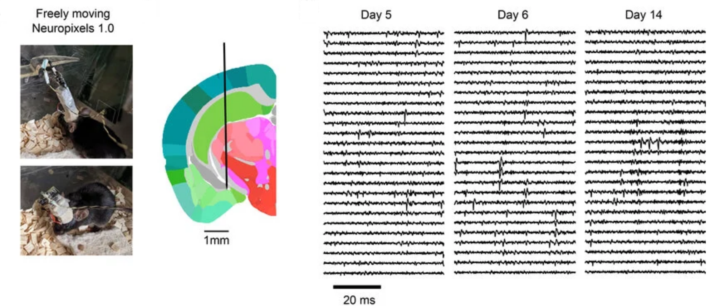
  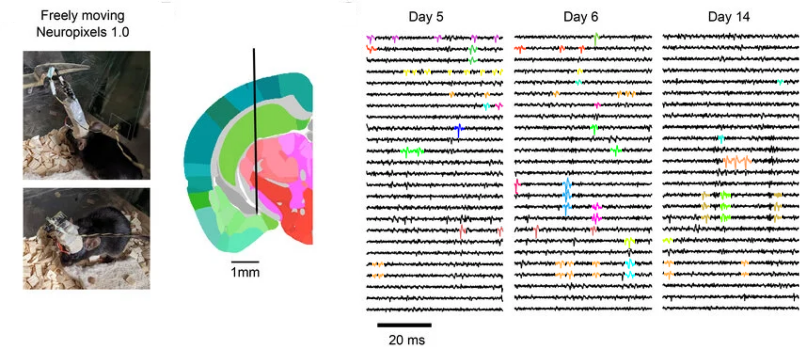

  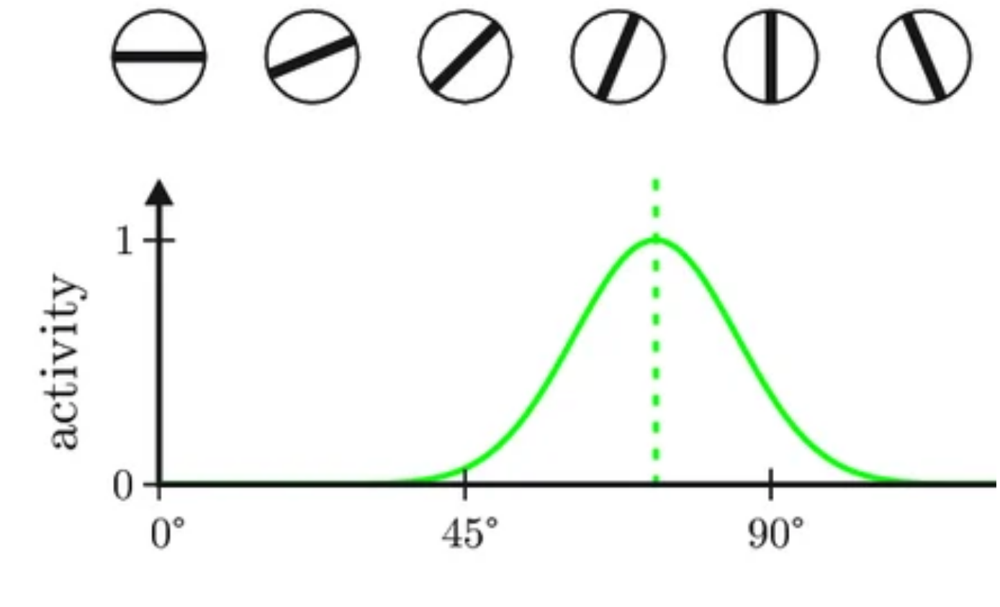

:::

::: {.ephys-process-grid}

<strong>1.</strong> Implant recording electrode

<strong>2.</strong> Record during behaviour of interest

<strong>3.</strong> Identify action potentials in the recorded trace

<strong>4.</strong> Assign action potentials to neurons with spike sorting

<strong>5.</strong> Understand how neural activity encodes behaviour

:::

## Pros and cons {.ephys-compare-slide}

:::: {.ephys-compare-grid}

::: {.ephys-compare-col}
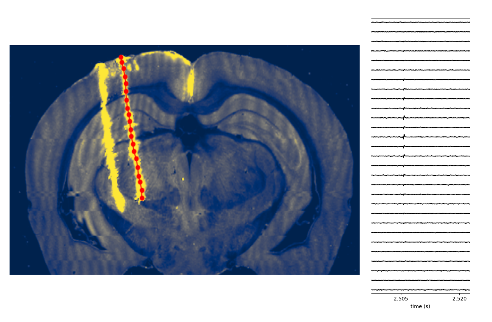{.ephys-compare-image fig-alt="Targeted deep electrophysiology recording and traces"}

<h3 class="ephys-compare-title">Electrophysiology</h3>

- ✅ High temporal resolution
- ✅ Targetted to deep and multiple regions
- ❌ Cannot easily identify individual neurons
:::

::: {.ephys-compare-col}
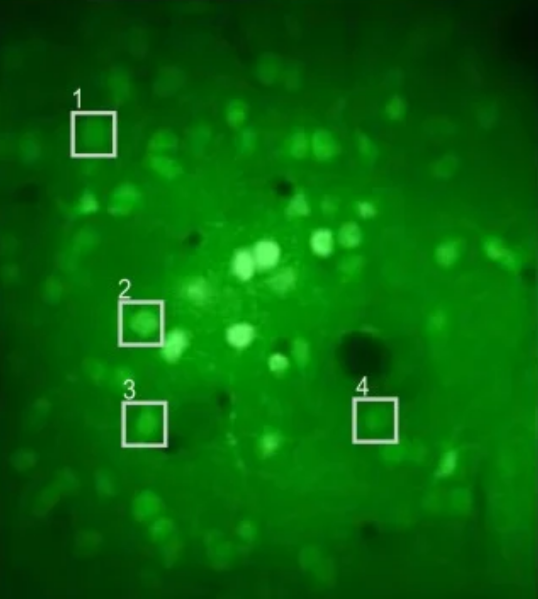{.ephys-compare-image fig-alt="Two-photon imaging field of view with labelled neurons"}

<h3 class="ephys-compare-title">Imaging</h3>

- ✅ Easy identification of individual neurons (genetically targetable)
- ❌ Low temporal resolution
- ❌ Limited depth and field of view
:::

::::

## Classic findings

:::: {.columns}

::: {.column width="50%"}
### Orientation selectivity (Hubel and Wiesel, 1962)

<iframe class="video-embed video-embed-classic video-embed-center" src="https://www.youtube-nocookie.com/embed/IOHayh06LJ4" title="Hubel and Wiesel orientation selectivity" frameborder="0" allow="accelerometer; autoplay; clipboard-write; encrypted-media; gyroscope; picture-in-picture; web-share" allowfullscreen></iframe>

:::

::: {.column width="50%"}

### Motor population encoding (Georgopoulos, 1986)

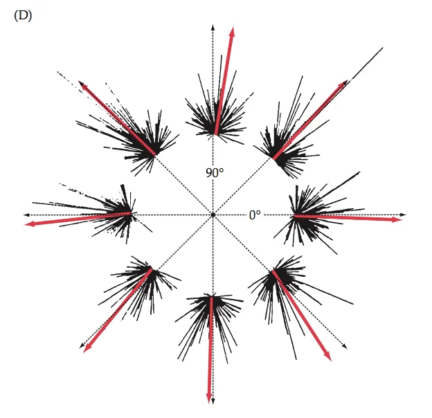{.classic-findings-image fig-alt="Georgopoulos 1986 motor population encoding figure"}

:::

::::

## Classic findings

:::: {.columns}

::: {.column width="50%"}
### Hippocampal space encoding

Place cells

<iframe class="video-embed video-embed-place-cell" src="https://www.youtube-nocookie.com/embed/STyd1qJr3yM" title="Hippocampal place cells" frameborder="0" allow="accelerometer; autoplay; clipboard-write; encrypted-media; gyroscope; picture-in-picture; web-share" allowfullscreen></iframe>

Theta phase precession

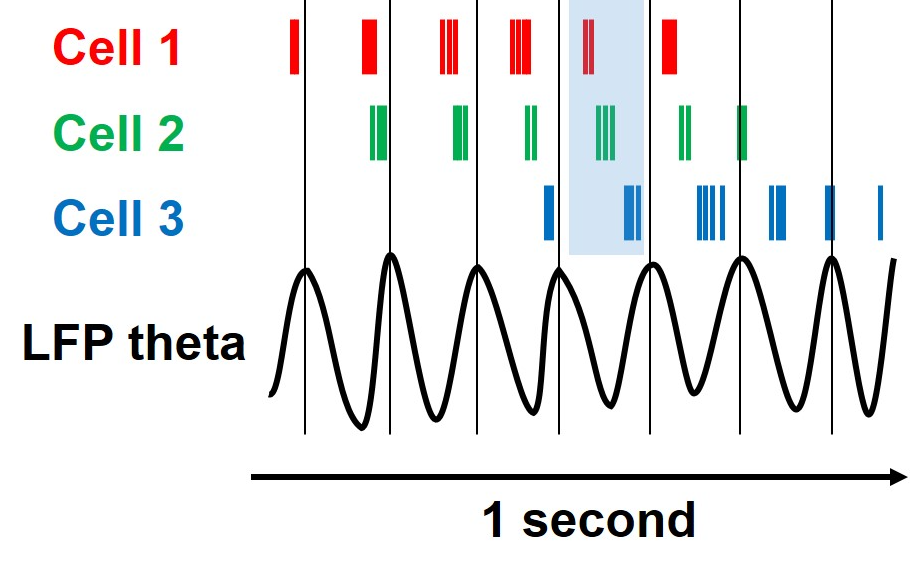{.classic-findings-image-medium .classic-findings-image-compact fig-alt="Theta phase precession example"}
:::

::: {.column width="50%"}

### Brain-wide map (The International Brain Laboratory et al., 2023)

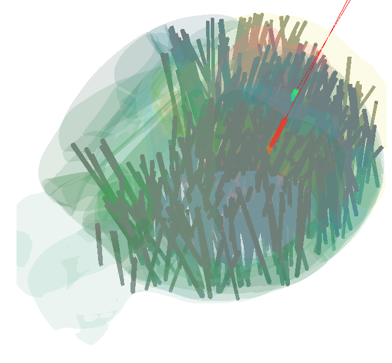{.classic-findings-image fig-alt="International Brain Laboratory brain-wide map"}

:::

::::

## In the clinic

<iframe class="video-embed video-embed-clinic video-embed-center" src="https://www.youtube-nocookie.com/embed/iTZ2N-HJbwA" title="Recording example" frameborder="0" allow="accelerometer; autoplay; clipboard-write; encrypted-media; gyroscope; picture-in-picture; web-share" allowfullscreen></iframe>

## Evolution of recording devices

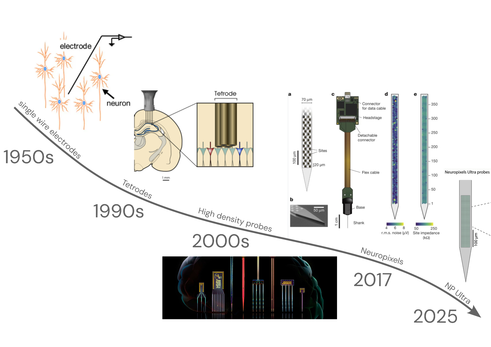{.slide-image-centered fig-alt="Timeline of recording devices"}

## The recording set up

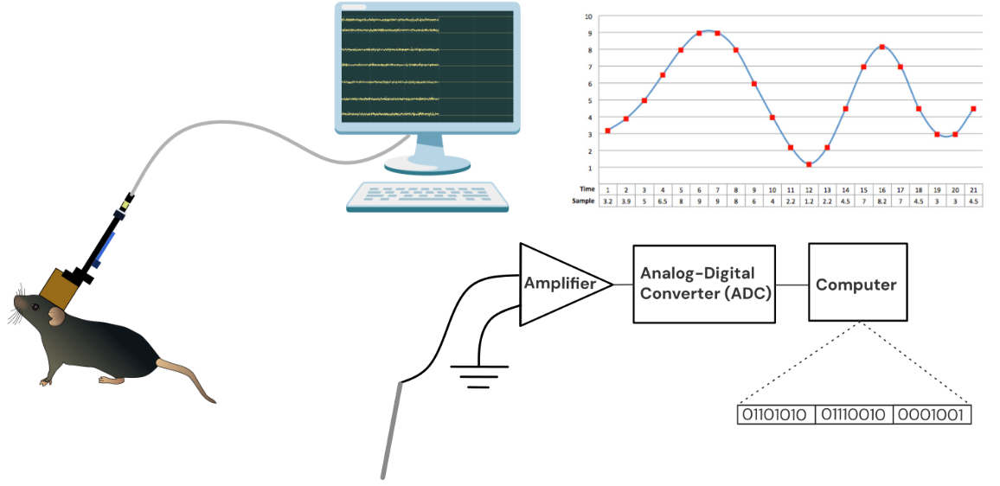{fig-alt="Electrode to amplifier to analog to digital conversion to computer recording setup"}

## Extracellular electrophysiological data {data-transition="none"}

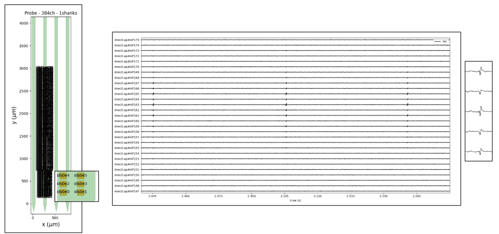{fig-alt="Extracellular electrophysiology line traces across channels"}

## Extracellular electrophysiological data {data-transition="none"}

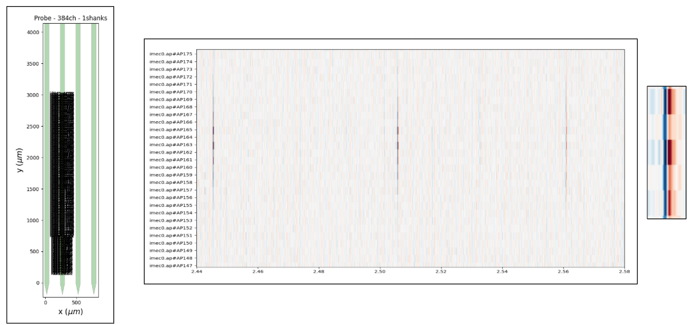{fig-alt="Extracellular electrophysiology spatial map view"}

## The sorting pipeline

## Course timeline review

## SpikeInterface: a common API for open-source electrophysiological tools

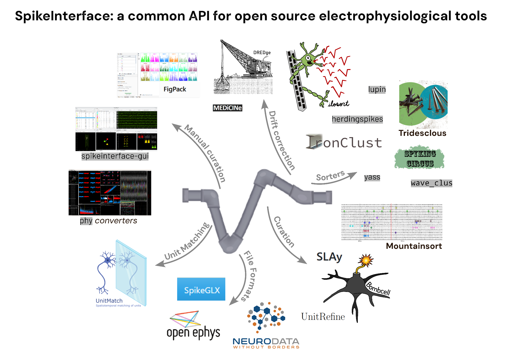{fig-alt="SpikeInterface common API for open-source electrophysiological tools"}

## The goal of the course: fun and learning!

::: {.r-fit-text style="color:#2e8b57;"}
Mathematical topics and being "comfortable in confusion"
:::

 

> It is like being lost in a jungle and trying to use all the knowledge that you can gather to come up with some new tricks, and with some luck, you might find a way out.
>
> — **Maryam Mirzakhani**, Fields medal winner

> So each of these breakthroughs... couldn't exist without the many months of stumbling around in the dark that precede them.
>
> — **Andrew Wiles**, solved Fermat's last theorem

## The goal of the course: fun and learning! {.math-goal-slide}

  

    
It is like being lost in a jungle and trying to use all the knowledge that you can gather to come up with some new tricks, and with some luck, you might find a way out.

    
<strong>Maryam Mirzakhani</strong>, Fields medal winner

  

  

    
So each of these breakthroughs, they are the culmination of, and couldn't exist without, the many months of stumbling around in the dark that precede them.

    
<strong>Andrew Wiles</strong>, solved Fermat's last theorem

  

  
Mathematical topics and being "comfortable in confusion"

  

    
My advisor once told me that doing math is 98% being confused and 2% figuring it out.

  

  

    
If I spend an entire day and all I do is understand this one feature of this one object that I didn't understand before, then that's a great day.

  

  
<strong>Mathematics PhD Students</strong>

## The coding segment

::: {.r-fit-text}
(explain how it will work)

Suggestions on how to run the code
:::

